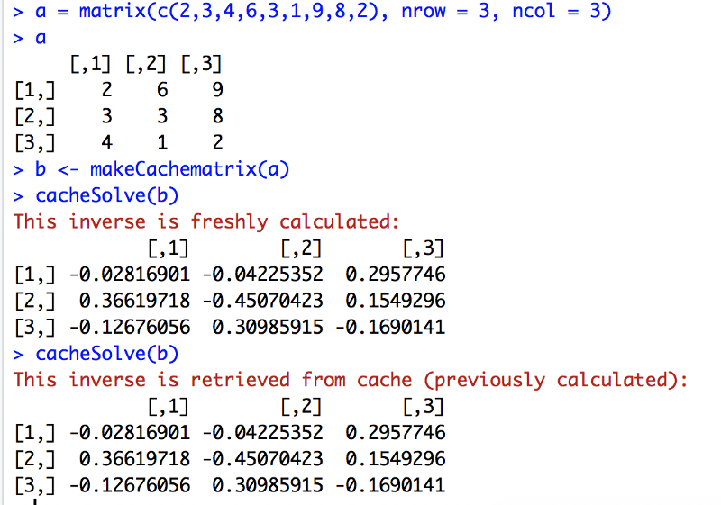

## Found in Translation: R and Python

As a student first of R and then of Python, I noticed an overall difference in approach: R tends to be used for functional programming while Python programs emphasize object orientation. Object-oriented R, rarely deployed during data analysis, seems to be confined mainly to writing packages for R. However, this usage pattern need not be the case.

In fact, R, like Python, is made up entirely of objects, and classes and methods can be defined. Python, like R, has lexical scoping and allows functions to return functions.

To investigate the subject further — and having enjoyed translating natural languages in the past — I decided to translate to Python some short, nested functions I had written for an assignment in R. An unexpected but illuminating second translation soon followed.

The purpose of the code below is to save processing time by caching the inverse of a matrix so that it is not repeatedly inverted (an expensive operation for larger matrices). The function makeCachematrix takes a matrix (assumed square and invertible) and returns a list of four functions that can operate on this matrix or its inverse (found in the parent environment, makeCachematrix). These closures can then be passed as an argument to cacheSolve, which checks whether there is already a stored inverse and, if so, returns it. If not, the inverse is calculated, stored and returned. The storage part involves write access to the parent environment, makeCachematrix, where the function getinv is defined. This is why getinv uses R’s deep assignment arrow, <<-, instead of <-. (The function set also uses <<- but is never deployed in cacheSolve. It could be used in the future to manually reset the original matrix.)

```
makeCachematrix <- function(x = matrix()) {
        inv <- NULL
        set <- function(y) {
              x <<- y
              inv <<- NULL
        }
        get <- function() x
        setinv <- function(inverse) inv <<- inverse
        getinv <- function() inv
        list(set = set, get = get,
            setinv = setinv,
            getinv = getinv)
}
cacheSolve <- function(x, ...) {
        inv <- x$getinv()
        if(!is.null(inv)) {
            message("This inverse is retrieved from cache (previously calculated):")
            return(inv)
        }
        data <- x$get()
        inv <- solve(data, ...)
        x$setinv(inv)
        message("This inverse is freshly calculated:")
        inv
}
```

Below, the inverse of the input matrix a is calculated (via R’s solve function) the first time cacheSolve is called but retrieved from memory the next time and until a different matrix is fed into makeCachematrix.



```{r pressure, echo=FALSE}
plot(pressure)
```

