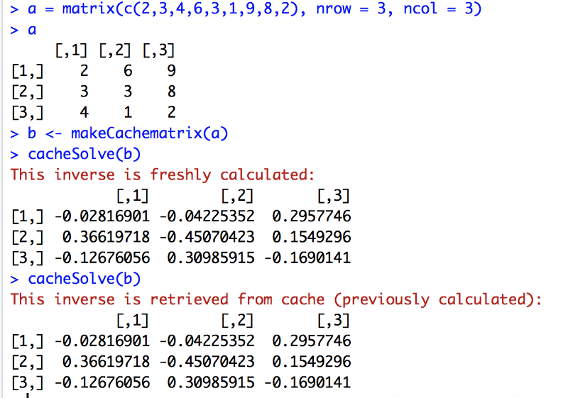

## Found in Translation: R and Python

As a student first of R and then of Python, I noticed an overall difference in approach: R tends to be used for functional programming while Python programs emphasize object orientation. Object-oriented R, rarely deployed during data analysis, seems to be confined mainly to writing packages for R. However, this usage pattern need not be the case.

In fact, R, like Python, is made up entirely of objects, and classes and methods can be defined. Python, like R, has lexical scoping and allows functions to return functions.

To investigate the subject further — and having enjoyed translating natural languages in the past — I decided to translate to Python some short, nested functions I had written for an assignment in R. An unexpected but illuminating second translation soon followed.

The purpose of the code below is to save processing time by caching the inverse of a matrix so that it is not repeatedly inverted (an expensive operation for larger matrices). The function `makeCachematrix` takes a matrix (assumed square and invertible) and returns a list of four functions that can operate on this matrix or its inverse (found in the parent environment, `makeCachematrix`). These closures can then be passed as an argument to `cacheSolve`, which checks whether there is already a stored inverse and, if so, returns it. If not, the inverse is calculated, stored and returned. The storage part involves write access to the parent environment, `makeCachematrix`, where the function `getinv` is defined. This is why `getinv` uses R’s deep assignment arrow, `<<-`, instead of `<-`. (The function `set` also uses `<<-` but is never deployed in `cacheSolve`. It could be used in the future to manually reset the original matrix.)

``` r
makeCachematrix <- function(x = matrix()) {
        inv <- NULL
        set <- function(y) {
              x <<- y
              inv <<- NULL
        }
        get <- function() x
        setinv <- function(inverse) inv <<- inverse
        getinv <- function() inv
        list(set = set, get = get,
            setinv = setinv,
            getinv = getinv)
}
cacheSolve <- function(x, ...) {
        inv <- x$getinv()
        if(!is.null(inv)) {
            message("This inverse is retrieved from cache (previously calculated):")
            return(inv)
        }
        data <- x$get()
        inv <- solve(data, ...)
        x$setinv(inv)
        message("This inverse is freshly calculated:")
        inv
}
```

Below, the inverse of the input matrix `a` is calculated (via R’s `solve` function) the first time `cacheSolve` is called but retrieved from memory the next time and until a different matrix is fed into `makeCachematrix`.



Very little changed as I translated the above to Python, which has the `nonlocal` keyword (instead of `<<-`) to indicate setting values in the parent environment. But now we have an example of functional programming in Python:

``` python
import numpy as np
from numpy.linalg import inv

def make_cache_matrix(matrix):
    inverse = None
    def set(new_matrix):
        nonlocal matrix
        matrix = new_matrix
        nonlocal inverse
        inverse = None
    def get():
        return matrix
    def set_inverse(new_inverse):
        nonlocal inverse
        inverse = new_inverse
    def get_inverse():
        return inverse
    return {'set' : set, 'get': get, 'set_inverse': set_inverse, 'get_inverse': get_inverse}

def cache_solve(function_dict):
    inverse = function_dict['get_inverse']()
    if inverse is not None:
        print("This inverse is retrieved from cache (previously calculated):")
        return(inverse)
    temp_matrix = function_dict['get']()
    inverse = inv(temp_matrix)
    function_dict['set_inverse'](inverse)
    print("This inverse is freshly calculated:")
    return inverse

test_matrix = np.append([[1, 9, 3], [5, 4, 6]], [[7, 5, 9]], axis=0)
test2 = np.append([[2, 9, 3], [5, 4, 6]], [[7, 5, 9]], axis=0)
```

The above is perfectly serviceable if a little odd, but a further translation — within Python but more radical than the transition from R — seems advisable: making the code object-oriented. In the end, the following Python seemed to me the most natural fit for the task at hand. The matrix-with-inverse construct no longer relies on lexical scoping to keep track of its attributes, reference to parent environments is no longer required, and the code is at its most readable.

``` python
import numpy as np
from numpy.linalg import inv

class Mat_with_cache:

    def __init__(self, init_matrix, init_inverse = None):
        self._matrix = init_matrix
        self._inverse = init_inverse

    @property
    def matrix(self):
        return self._matrix

    @matrix.setter
    def matrix(self, new_matrix):
        self._matrix = new_matrix
        self._inverse = None

    @property
    def inverse(self):
        return self._inverse

    @inverse.setter
    def inverse(self, new_inverse):
        self._inverse = new_inverse

def cache_solve(mwc):
    inverted = mwc.inverse
    if inverted is not None:
        print("This inverse is retrieved from cache (previously calculated):")
        return(inverted)
    temp_matrix = mwc.matrix
    inverted = inv(temp_matrix)
    mwc.inverse = inverted
    print("This inverse is freshly calculated:")
    return inverted

test_matrix = np.append([[1, 9, 3], [5, 4, 6]], [[7, 5, 9]], axis=0)
test2 = np.append([[2, 9, 3], [5, 4, 6]], [[7, 5, 9]], axis=0)
```

I have not yet attempted to translate the original R into an object-oriented version in R. This is perhaps for the same reason that makes objected-oriented R code relatively rare: it’s a bit complicated. R has three different kinds of objects that can be used for classes. Methods do not belong to objects or classes but to generic functions. Classes are not formally defined, so lists of mixed data types are often used as classes in R.
